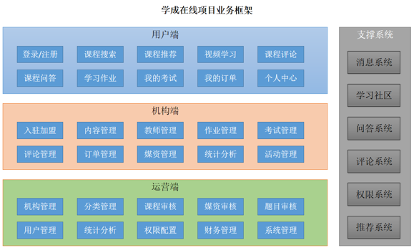
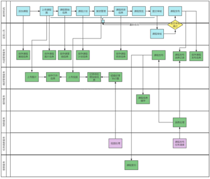
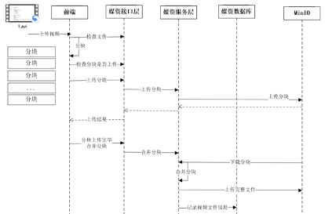
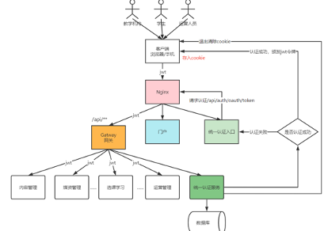
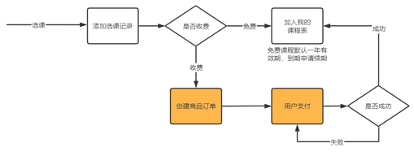
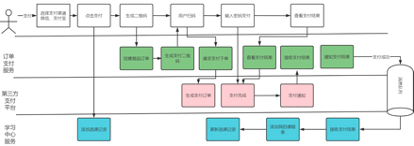
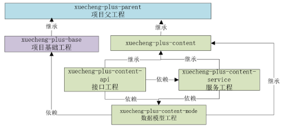
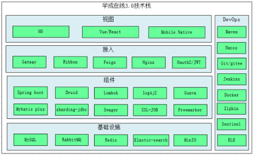
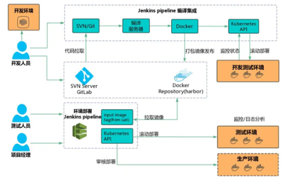
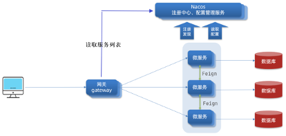

# xuecheng-plus-project


## 学成在线微服务项目

### 项目说明
```
├── api-test                   // api-test模块
├── doc                        // 项目各个章节文档
├── spl                        // 项目用到的数据库sql文件
├── static                     // 静态资源
├── xuecheng-plus-auth         // 认证授权模块
├── xuecheng-plus-base         // 项目配置/声明
├── xuecheng-plus-checkcode    // 验证码模块
├── xuecheng-plus-content      // 课程内容模块
├── xuecheng-plus-gateway      // 网关模块
├── xuecheng-plus-generator    // mybatis-plus generator生成器
├── xuecheng-plus-learning     // 选课学习模块
├── xuecheng-plus-media        // 媒资模块
├── xuecheng-plus-message-sdk  // 消息模块
├── xuecheng-plus-orders       // 订单支付模块
├── xuecheng-plus-parent       // 项目父工程
├── xuecheng-plus-search       // 搜索模块
└── xuecheng-plus-system       // 基础属性定义
```

### 项目介绍


**内容模块介绍**



**媒资模块介绍**



**认证授权模块介绍**



**选课学习授权模块介绍**



**订单支付授权模块介绍**



### Maven说明


### 技术栈


### 集成说明


### 网关说明


### nginx配置文件

[nginx配置](./static/nginx.conf)

## 说明

1. 现阶段支付宝支付沙箱关键支持在浏览器直接模拟，无需安装沙箱支付宝app。只需要在沙箱账户注册账号即可。

2. 因为项目部署在jenkins侧流水线配置较为复杂，所以项目暂未在服务器实际部署测试。